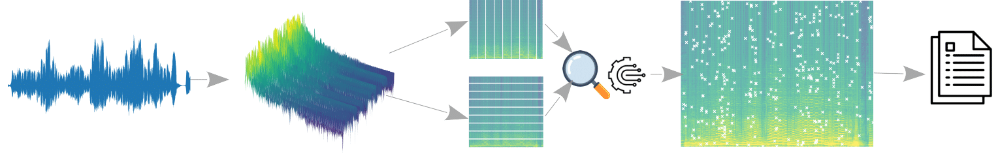

SpectroMap
======================


[](https://pypi.python.org/pypi/uwtopsis/)


SpectroMap is a peak detection algorithm that computes the constellation map (or audio fingerprint) of a given signal.



Installation
======================

You can install the SpectroMap library from GitHub:

```terminal
git clone https://github.com/Aaron-AALG/spectromap.git
python3 -m pip install -e spectromap
```

You can also install it directly from PyPI:

```terminal
pip install spectromap
```

Usage
======================

This packages contains the spectromap object that manages the full process of audio fingerprinting extraction. Given a signal Y, we just have to instantiate the class with Y and the corresponding kwargs (if needed).

spectrogram object
------------------

An example to apply SpectroMap over a signal is:

```python
import numpy as np
from spectromap.functions.spectromap import spectromap

y = np.random.rand(44100)
kwargs = {'fs': 22050, 'nfft': 512, 'noverlap':64}

# Instantiate the SpectroMap object
SMap = spectromap(y, **kwargs)

# Get the spectrogram representation plus its time and frequency bands
f, t, S = SMap.get_spectrogram()

# Extract the topological prominent elements from the spectrogram, known as "Peak detection".
# We get the coordinates (time, freq) of the peaks and the matrix with just these peaks.
fraction = 0.15 # Fraction of spectrogram to compute local comparisons
condition = 2   # Axis to analyze (0: Time, 1: Frequency, 2: Time+Frequency)
id_peaks, peaks = SMap.peak_matrix(fraction, condition)

# Get the peaks coordinates as as (s, Hz, dB)-array.
extraction_t_f_dB = SMap.from_peaks_to_array()
```

peak_search function
------------------

In case you desire to compute the spectrogram by yourself, then you can make use of the peak search function instead.

```python
from spectromap.functions.spectromap import peak_search

fraction = 0.05 # Fraction of spectrogram to compute local comparisons
condition = 2   # Axis to analyze (0: Time, 1: Frequency, 2: Time+Frequency)
id_peaks, peaks = peak_search(spectrogram, fraction, condition)
```
