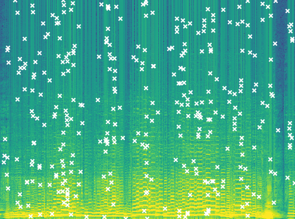
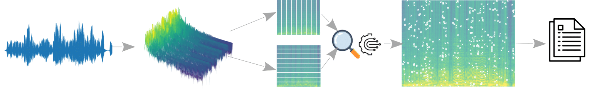

# Summary

In computer science, fingerprinting is a procedure that summarizes the input data by mapping it to a much shorter item. Similarly to human fingerprints, such transformation contains the basic information and properties of the original data, so it can be used to identify it among other samples. In regard of the acoustic field, audio fingerprinting is understood as an algorithm that extracts the main component taking into account the perceptual characteristics of the audio. Most of the time, these techniques are applied over the spectrogram representation of the signal. Wang, developed the idea of constellation map for Shazam Entertainment in order to implement an audio search algorithm [@wang2003]. Over the years, many different techniques have been developed [@Cano2005], for example, we can also find recognition of activities of daily living via audio [@Pires2018]. In this paper, we have developed an open source audio search algorithm written in Python programming language.

# Statement of need

With the aim of implementing a fingerprint extraction for a given musical signal $X_t$, we have designed an algorithm that computes a global peak detection over the spectrogram associated to give us its constellation map. Let $N_{FFT}$ and $N_O$ be the length of the Fast Fourier Transform (FFT) window and the number of elements to overlap between segments respectively, we first compute the spectrogram of the signal ($S_{tfa}$), by using the Hamming window, in order to get the (time, frequency, amplitude) vectors by considering these two parameters. Such representation contains the amplitude spatial information to analyze. Our engine search determines whether a time-frequency point can be considered locally relevant according to its neighbourhood. Then, the detection is processed regarding a required band.
Let $T$ and $F$ be the time and frequency bands of the spectrogram with the amplitude of the event, we can reformulate the spectrogram as its rows and columns representations.

$$ S_{tfa} = (T_i^1, ..., T_i^n) = (F_j^1, ..., F_j^m). $$

As part of the engine search, we define two windows to process the local pairwise comparisons with a respective length of $d_T$ and $d_F$, whose functionality is to extract a number of elements of the band and return the local maximum. Without limiting the generality of the foregoing, we can mathematically describe the time-band window mechanism with length of $0< d_T\le n$ and structure $T_i = (T_i^1, ..., T_i^n)$ as:

$$ \phi_T^{d_T}(T_i) = \left(\max{\{T_i^k, ..., T_i^{k+d_T}\}}\right)_{1\le k\le n-d_T-1} \hbox{, per each } i\in\{1,...,n\}. $$

When we group all the values we drop those elements that have equal index to avoid duplicates. Hence, we can group the window of each band to create the set:

$$ \Phi_T^{d_T} = \{\phi_T^{d_T}(T_i)\}_{i=1}^n. $$

This way, we get the topologically prominent elements per each feature vector. Owing to the first equation, is is easy to note that even though there are $n-d_T-1$ matches, the window may contain a smaller number of elements whenever $d_T > 2$. Depending of how restrictive we need to be, we can proceed with just one of the bands or combine them to create a more stringent search and distortion resistant since it is returned only the peaks that are prominent in both directions. Finally, the algorithm merge all the band-dependent peaks, as shown in equation 3, to give us the total number of spatial points that determine the so-called audio fingerprint. In \autoref{fig:spectrogram}, we can see a graphical example.




# Algorithm

Our engine search, named SpectroMap, processes audio signals in order to return an output file with the (time, frequency, amplitude) peaks detected in its spectrogram representation. Thus, it can be combined with the Mercury software to complete an in-depth comparison between music excerpts. Figure \autoref{fig:algorithm} has a cursory description of the performance of SpectroMap. The algorithm basically batches the files by means of the following steps:

1. Decide the window to use and set the parameters $N_{FFT}$ and $N_O$.
2. Read the audio file to get its amplitude vector and its sample rate.
3. Compute the spectrogram through the associated Fourier transformations.
4. Set a fixed window length ($d_T$, $d_F$ or both) for the pairwise comparisons.
5. Choose the settings to proceed with the peak detection over a selected band or a combination of both.
6. Create an identification matrix which consists in a binary matrix with the same shape as the spectrogram with the position of the highlighted prominences.
7. Extract such elements and create a file with the (time, frequency, amplitude) vectors.

Regarding the step 5, authors highly recommend to select both bands to perform the peak detection since the output is more filtered and spatially consistent. For the remainder steps, its choice is a personal decision that depends on the scope of the research. It is noteworthy to mention that the limitations of the method depend on the functionality of the Signal module of the SciPy library.



# Python implementation

This section is dedicated to the application of the SpectroMap algorithm to some kind of examples. In particular, the module is designed to process raw signals or spectrograms. For the first case, we make use of the `spectromap` object. For the second case, we apply the `peak_search` function.

## Application over a raw signal

```python
import numpy as np
from spectromap.functions.spectromap import spectromap

y = np.random.rand(44100)
kwargs = {'fs': 22050, 'nfft': 512, 'noverlap':64}

# Instantiate the SpectroMap object
SMap = spectromap(y, **kwargs)

# Get the spectrogram representation plus its time and frequency bands
f, t, S = SMap.get_spectrogram()

# Extract the topological prominent elements from the spectrogram.
# Coordinates matrix as (time, freq)
# Peak matrix.
fraction = 0.15 # Fraction of spectrogram to compute local comparisons
condition = 2   # Axis to analyze (0: Time, 1: Frequency, 2: Time+Frequency)
id_peaks, peaks = SMap.peak_matrix(fraction, condition)

# Get the peaks coordinates as as (s, Hz, dB)-array.
extraction_t_f_dB = SMap.from_peaks_to_array()
```

## Application over a given spectrogram

```python
from spectromap.functions.spectromap import peak_search

fraction = 0.05 # Fraction of spectrogram to compute local comparisons
condition = 2   # Axis to analyze (0: Time, 1: Frequency, 2: Time+Frequency)
id_peaks, peaks = peak_search(spectrogram, fraction, condition)
```

# Acknowledgements

This packages was developed as an application in music plagiarism: _A proposal to compare the similarity between musical products. One more step for automated plagiarism detection?_ [doi:10.1007/978-3-031-07015-0_16](http://dx.doi.org/10.1007/978-3-031-07015-0_16), in order to reduce the computational cost that imply music comparisons.

# References
